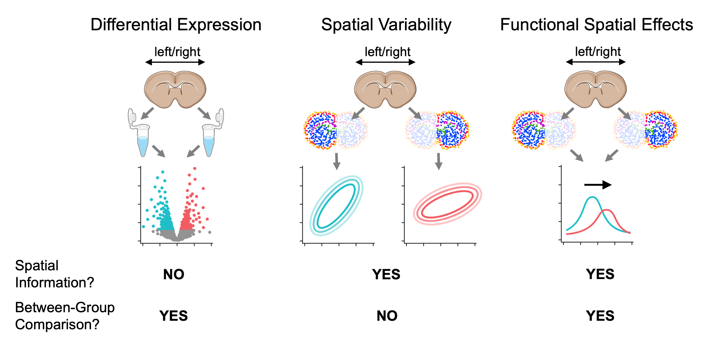
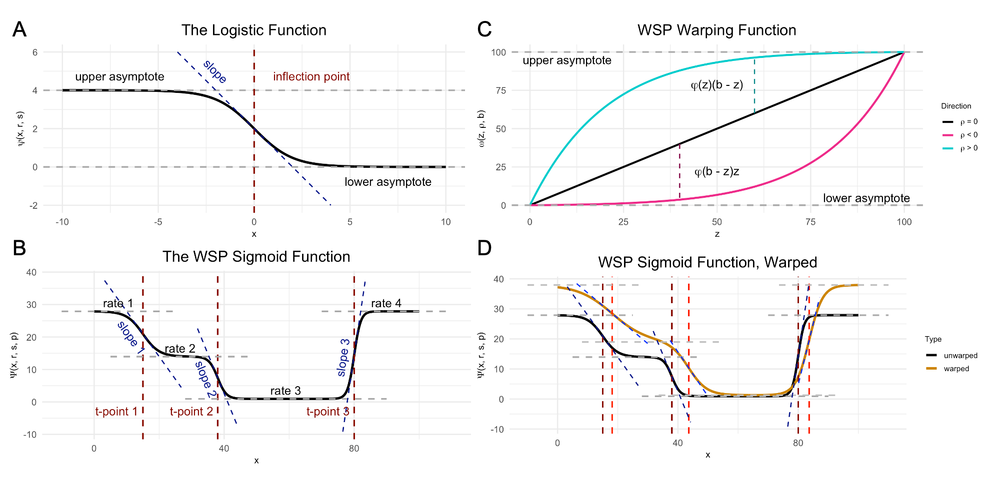
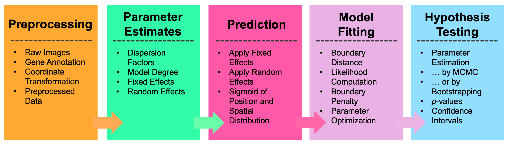
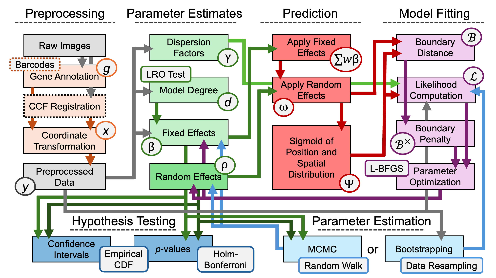

# Introduction

Wispack (pronounced "wisp package" or "wisp pack") is an R package for testing for between-group effects on spatial variation in spatial transcriptomics data, i.e., functional spatial effects (FSE). 

<div class="figure">
  
  <p class="caption">True-color image of fluorescing probes bound to mRNA molecules in cortical cells, the raw data of spatial transcriptomics.</p>
</div>

Unlike SVG testing (spatially variable gene) which only involves testing for spatial variation of gene expression within a group, and unlike differential expression (DE) analysis which tests for between-group effects without regard to spatial distribution, testing for FSE involves testing whether a factor such as age or rearing conditions has a nonzero effect on spatial variation between groups differing on that factor.

<div class="figure">
  
  <p class="caption">Comparison between testing for differentially expressed genes, spatially variable genes, and genes with function spatial effects. For visualization purposes, mouse brain slices represent the </p>
</div>

Wispack performs FSE testing by first using change-point detection to find spatial variation in samples, then fitting a nonlinear mixed-effect model to the detected change points. The core of the nonlinear model is a parameterization of the found change-points as inflections in logistic functions representing gradients of gene expression change. Multiple change-points are handled by summing the component logistic functions into a "poly-sigmoid" function. Fixed effects (such as age or rearing conditions) are then modeled as effects on the underlying logistic parameters. Random (within group) effects are modeled as further nonlinear warping of the poly-sigmoid. Significance testing is performed on the effects through either bootstrapping or MCMC resampling. A complete technical description of wisp models can be found in this [preprint](https://doi.org/10.1101/2025.06.11.659209). 

<div class="figure">
  
  <p class="caption">Demo plots of the functions involved in wisp. (A) The logistic function, used to model a single change point in gene expression. (B) The wisp poly-sigmoid function, built from three logistic components, representing three change points. (C) The warping function used to represent random effects, e.g., variation due to differences between individual animals or due to measurement noise. (D) The wisp poly-sigmoid from (B) with warping function applied.</p>
</div>

Wispack provides a simple user-facing function, wisp(), which takes a data frame in the familiar format expected by standard R functions for linear models (e.g., lm() and lmer()) and runs the complete test for FSEs. Preprocessing of the data is generally required before passing it to wisp(), after which wisp() executes a pipeline involving parameter estimates, prediction, model fitting, and hypothesis testing. 

<div class="figure">
  
  <p class="caption">Top-level overview of wisp modeling pipeline.</p>
</div>

As shown by the figure below, the steps of this pipeline are nonlinear and recurrent. 

<div class="figure">
  
  <p class="caption">Full modeling pipeline for wisp. Boxes represent variables in the model, or operations performed on variables. Arrows represent input-output relationships between these variables and operations.</p>
</div>
 
Unlike standard linear modeling packages in R which require a model formula, wisp() merely needs the data. For example, the quick-start demo (which uses data on RORB expression across the laminar axis of the primary somatosensory cortex) runs the following code: 

```R
# Set random seed for reproducibility
ran.seed <- 123
set.seed(ran.seed)

# Load wispack
library(wispack)

# Load demo data
countdata <- read.csv(system.file(
  "extdata", 
  "S1_laminar_countdata_demo_default_col_names.csv", 
  package = "wispack"
  ))

# Fit model
laminar.model <- wisp(countdata)

# View model 
View(laminar.model)
```

No model formula is required, as all wisp models have the same mathematical form. However, the variables involved in that form can, of course, have different names. These names will come from the column names of the data and can be set manually by the user, as so: 

```R
# Define variables in the dataframe for the model
data.variables <- list(
    count = "count",
    bin = "bin", 
    parent = "cortex", 
    child = "gene",
    ran = "mouse",
    fixedeffects = c("hemisphere", "age")
  )
  
# Fit model
laminar.model <- wisp(
    # Data to model
    count.data = countdata,
    # Variable labels
    variables = data.variables
  )
```

Both the quick-start demo and another demo showing all model options can be run using the demo() command: 

```R
demo("quick_start", package = "wispack")  
demo("full_options", package = "wispack")
```

Please see the tutorials for more detailed walkthroughs of the package and its options.

Copyright (C) 2025, Michael Barkasi
barkasi@wustl.edu
