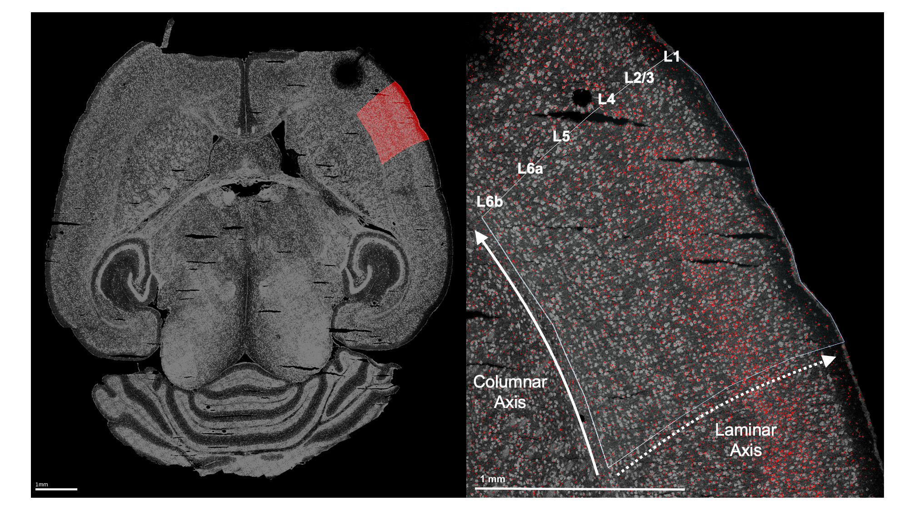

The gene RORB plays a key role in the development of sensorimotor cortex in rodents. RORB expression leads axons from thalamic neurons to innervate layer 4 of the cortex. These thalamocortical projections organize into discrete "barrel" formations, each barrel containing the inputs from neurons responsive to a single whisker. 

While it's generally assumed that there are no major differences between barrel formations in the left and right hemispheres ("laterality"), over the years there have been several histological studies suggesting age and sex-dependent hemispheric differences. Given the established role of RORB in barrel formation, one might want to test for age or sex-dependent laterality in RORB expression. 

<h1> Preprocessing the raw data </h1>

To test for effects of laterality in RORB expression, this example uses data collected from four male wild-type mice at two ages: postnatal day 12 (P12) and postnatal day 18 (P18). We started with raw, non-normalized mRNA counts from the cells within the primary sensorimotor cortex (S1), both left and right hemispheres. Before using any functions from wispack, we identified S1 in each sample by manually fitting the entire slice to CCFv3 and then extracting the S1 region.

<div class="figure">
  
  <p class="caption">Left: Example horizontal slice as reconstructed from MERFISH data. Red highlight indicates the right primary sensorimotor cortex. Right: The right sensorimotor cortex, with RORB molecules in red and laminar and columnar axes labeled.</p>
</div>

As wisp can only model one dimension of spatial variation (at least, as-of the writing of this demo for v1.0), we need to identify this axis and transform the RORB molecule coordinates into it. As we are primarily concerned with how RORB is distributed across cortical layers, the laminar axis is the obviously candidate. Coordinate transformation into an axis of interest must be done outside of wispack. For this case, we wrote a custom coordinate transformation described in this [preprint](https://doi.org/10.1101/2025.06.11.659209) and available as code in this [repo](https://github.com/Oviedo-Lab/wspmm_methods.git) (see function cortical_coordinate_transform in script merfish_preprocessing.R). 

<div class="figure">
  
  <p class="caption">Visualization of coordinate transform steps from initial CCFv3 registration to laminar and columnar axes.</p>
</div>

<h1> Loading the data </h1>

Wispack contains a csv file with the results of this coordinate transformation applied to the raw data. To start, load this data and print its first few rows: 

```{r load_data}
countdata <- read.csv(
  system.file(
    "extdata", 
    "S1_laminar_countdata_demo.csv", 
    package = "wispack"
    )
  )

print(head(countdata))
```

As can be seen, the imported data is a data frame with the columns: count, bin, cortex, gene, mouse, hemisphere, age. Although we're focused on RORB, these first few rows show that there are other genes in the data as well. How many? 

```{r n_genes}
num_genes <- length(unique(countdata$gene))
cat("Number of genes:", num_genes, "\n")
```

Which genes? 

```{r name_genes}
cat("Gene names:", paste0(unique(countdata$gene), collapse = ", "))
```

These additional genes are included for two reasons. First, just as RORB is known to be localized to L4, the other genes are also known to be localized to specific layers. So, the modeling results can be compared to known biology in all cases. Second, including multiple genes provides more implicit information for estimating things like random effects, and thus helps to avoid overfitting to any one gene. 

Each row in the data frame represents a cell from the left or right S1 region of one of the four mice. Each cell being represented in multiple rows, one row per gene. Hence, we can find the number of cells by dividing by the number of genes. 

```{r n_cells}
num_cells <- nrow(countdata)/num_genes
cat("Number of cells:", num_cells, "\n")
```

Notice that the count column thus gives the number of molecules of the RNA species listed in the gene column, found in the cell represented by a given row. Each cell, of course, comes from a specific mouse and brain hemisphere, information given in the correspondingly named columns. The age column gives the age of the mouse. 
